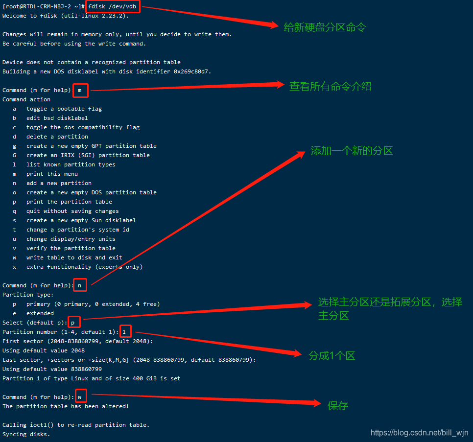
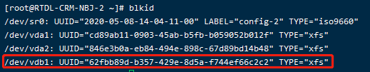
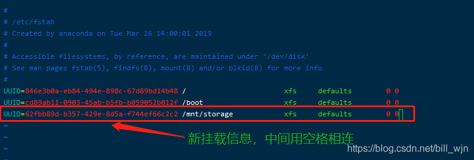

# linux挂载硬盘步骤

## 1.查看当前磁盘挂载情况

```shell
fdisk -l
```

## 2.查看当前分区情况

```shell
df -l
```

## 3.给新硬盘添加新分区

```shell
fdisk /dev/sdb

```

## 4.按照下面步骤依次输入指令



## 4.分区完成，查询所有设备的文件系统类型

```shell
blkid
```

> 发现新分区并没有文件系统类型（type为文件系统具体类型，有ext3,ext4,xfs,iso9660等，具体区别自行百度，本文建议使用xfs）

## 5.格式化分区

先查看当前系统支持格式化成什么类型，输入mkfs，然后按两下tab键

```shell
mkfs -t ext4 /dev/sdb
```

## 6.所有文件系统类型

```shell
blkid

```

## 7.挂载

> 挂载需要将硬盘挂载在挂载点上（一个文件夹），但是mount并不会创建文件夹，所以在使用mount命令之前首先创建挂载点

```shell
mkdir /ssd

```

> 将新分区 /dev/vdb1 挂载到/mnt/storage挂载点下

```shell
mount /dev/sdb /ssd
```

## 8.查看是否挂载成功

```shell
mount

```

## 9.设置自动挂载

> 磁盘被手动挂载之后都必须把挂载信息写入/etc/fstab这个文件中，否则下次开机启动时仍然需要重新挂载。系统开机时会主动读取/etc/fstab这个文件中的内容，根据文件里面的配置挂载磁盘。这样我们只需要将磁盘的挂载信息写入这个文件中我们就不需要每次开机启动之后手动进行挂载了。

### 9.1 通过blkid命令将分区的uuid查询出来



```shell
vim /etc/fstab
```



## 10.重启

```shell
reboot
```

## 11.查看磁盘信息

```shell
mount
```


