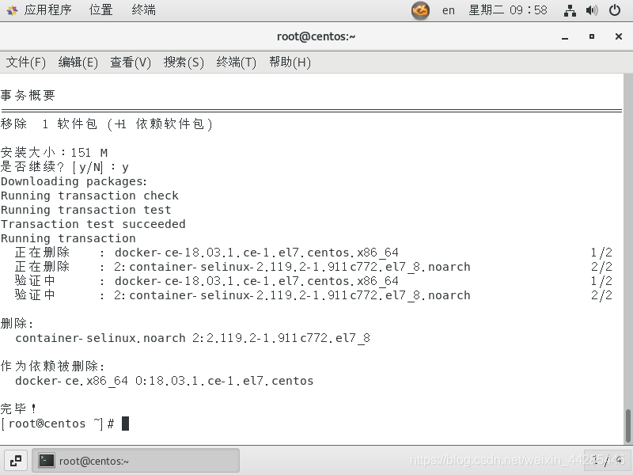
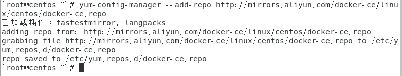
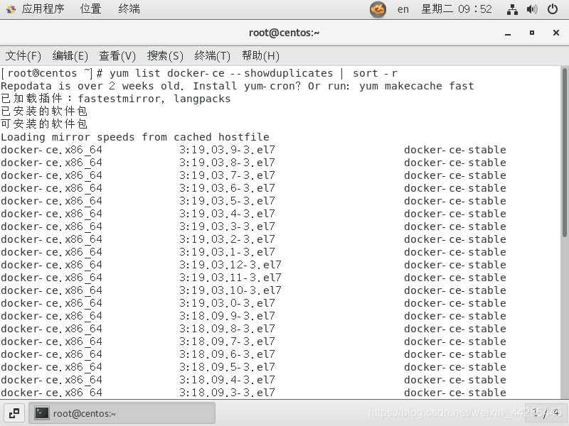
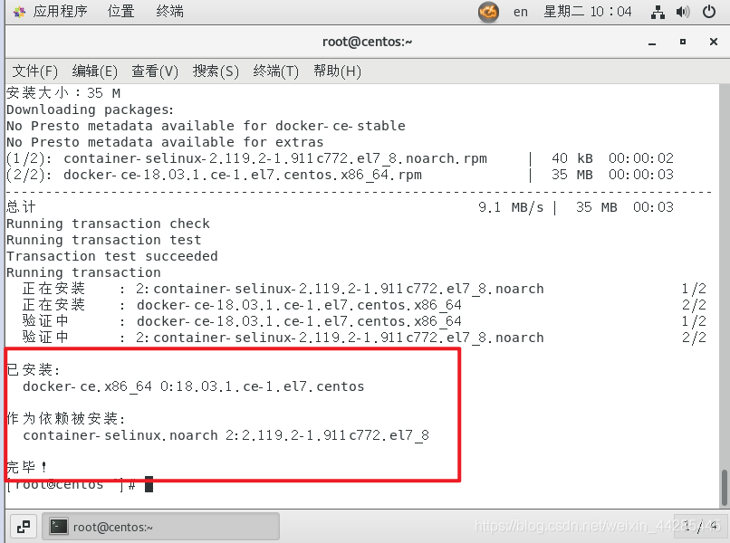

# 安装Docker

## 一、基本概念

### 1.什么是Docker

>`Docker` 是一个开源的应用[容器](https://cloud.tencent.com/product/tke?from=10680)引擎，让开发者可以打包他们的应用以及依赖包到一个可移植的容器中，然后发布到任何流行的 `Linux` 机器上，也可以实现虚拟化。容器是完全使用沙箱机制，相互之间不会有任何接口。 对我们而言，我觉得只需要把他理解成一个**便携的应用容器**即可

### 2.Docker对开发环境的好处

#### 2.1试错

> 对开发者而言，每天会催生出的各式各样的新技术都需要尝试，然而开发者却不太可能为他们一一搭建好环境并进行测试。时间非常宝贵，正是得益于 `Docker`，让我们有可能在一条或者几条命令内就搭建完环境，而且这个环境大到一个特定版本的操作系统，小到一个软件。Docker 有一个傻瓜化的获取软件的方法，`Docker`后台会自动获得环境镜像并且运行环境。

#### 2.2统一开发和生产环境

> 对于一般的小公司来说，搭建一个公用的开发环境是一件不那么划算的事情。那么就可以用`Docker`来统一开发环境，因为不管你用的是`Windows`、`Mac` 还是 `Ubuntu`。 如果生产环境也使用的`Docker`的话，你甚至可以直接打包一套环境，直接丢上去就可以运行了，再也不用担心开发-生产环境之间的差异了。

#### 2.3高性能

> 虚拟机的粒度是**虚拟出的机**，而`Docker`的粒度则是**被限制的应用**，相比较而言 Docker 的内存占用更少，更加轻量级，性能也更优。
>
> 而秒级的启动，也可以让我们启动电脑时候，开发环境的运行是无感知的。

#### 2.4成果展示

> 我们可能经常要给用户或者是同事展示一样功能的，但是搭建演示环境的过程却是非常麻烦的。现在可以直接将我们的镜像打包丢过去，而不必去做任何环境配置的工作，同时也不必担心他们的环境配置会导致我们的产品无法运行。

## 二、搭建原生版Centos环境

### 1.安装Docker

#### 在MAC平台下安装Docker

在`mac`平台下，就是去下载一个`dmg`的安装文件。

下载好了之后，双击，然后拖入就可以了，`windows`应该也是类似的。

> 就是安装`qq`一样简单，傻瓜式的。

附上`dockerhub`上的[下载链接](https://links.jianshu.com/go?to=https%3A%2F%2Flink.juejin.im%2F%3Ftarget%3Dhttps%3A%2F%2Fhub.docker.com%2Fsearch%2F%3Ftype%3Dedition%26amp%3Boffering%3Dcommunity)

成功之后属于`docker version`如果出来版本信息就是安装成功，类似如下

```shell
[root@localhost /]# docker version

Client: Docker Engine - Community
 Version:           18.09.0
 API version:       1.39
 Go version:        go1.10.4
 Git commit:        4d60db4
 Built:             Wed Nov  7 00:47:43 2018
 OS/Arch:           darwin/amd64
 Experimental:      false

Server: Docker Engine - Community
 Engine:
  Version:          18.09.0
  API version:      1.39 (minimum version 1.12)
  Go version:       go1.10.4
  Git commit:       4d60db4
  Built:            Wed Nov  7 00:55:00 2018
  OS/Arch:          linux/amd64
  Experimental:     true
```

#### 在Centos7 下安装Docker

##### 1.前置步骤(可忽略)

###### 使用 root 权限更新 yum 包

> 生产环境中此步操作需慎重，看自己情况，学习的话随便搞

```sh
[root@localhost /]# yum -y update
```

> 这个命令不是必须执行的，看个人情况，后面出现不兼容的情况的话就必须update了

```shell
#注意
yum -y update:升级所有包同时也升级软件和系统内核 
yum -y upgrade:只升级所有包,不升级软件和系统内核
```

###### 卸载旧版本

>如果之前安装过的话

```shell
[root@localhost /]# yum remove docker  docker-common docker-selinux docker-engine
```



##### 2.安装Docker的详细步骤

###### **1.安装需要的软件包**

```shell
# yum-util 提供yum-config-manager功能，另两个是devicemapper驱动依赖
yum install -y yum-utils device-mapper-persistent-data lvm2
```

###### **2.设置 yum 源**

设置一个yum源，下面两个都可用

```shell
yum-config-manager --add-repo http://download.docker.com/linux/centos/docker-ce.repo（中央仓库）
yum-config-manager --add-repo http://mirrors.aliyun.com/docker-ce/linux/centos/docker-ce.repo（阿里仓库）
```



###### 3.选择docker版本并安装 

```shell
#查看可用版本有哪些
yum list docker-ce --showduplicates | sort -r
```



###### 4.选择一个版本并安装

```shell
# yum install docker-ce-版本号
yum -y install docker-ce-18.03.1.ce
```

###### 5.出现下图说明安装成功



###### 4.启动 Docker 并设置开机自启

```shell
systemctl start docker
systemctl enable docker
```
