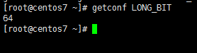
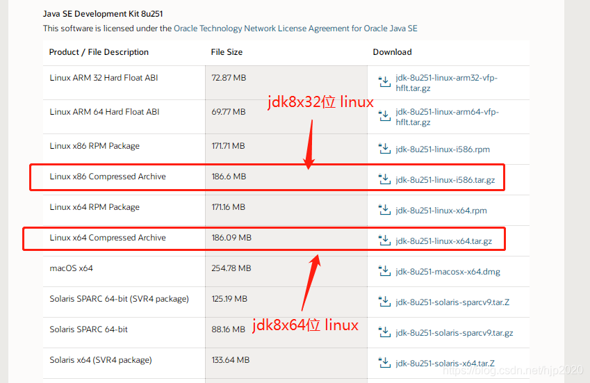

# Centos部署Java

## 1.先查看本地是否自带java环境：

```shell
yum list installed | grep java
```

## 2.卸载自带的java

```shell
yum -y remove java-1.8.0-openjdk * 

yum -y remove tzdata-java*
```

## 3.查看liunx信息

```shell
[root@centos7 ~]# getconf LONG_BIT
```



> 出现64，说明是64位的，如果是32就是32位的

## 4.创建JDK存放路径

```shell
mkdir /usr/local/java
```

## 5.进入官网下载JDK

[官网地址](https://www.oracle.com/cn/java/technologies/downloads/)



## 6.下载java：

```shell
cd /usr/local/java  #进入下载目录
wget JDK下载地址
tar -zxvf 下载的JDK文件
```

## 7.配置Java环境变量

```shell
vi /etc/profile #编辑环境变量

export JAVA_HOME=(安装jdk的目录，可以先去该目录下使用 pwd 命令查看)
export JRE_HOME=$JAVA_HOME/jre  
export PATH=$PATH:$JAVA_HOME/bin:$JRE_HOME/bin
export CLASSPATH=.:$JAVA_HOME/lib/dt.jar:$JAVA_HOME/lib/tools.jar:$JRE_HOME/lib
```

## 8.刷新配置文件

```shell
source /etc/profile  #使配置立即生效
```

## 9.检查Java安装和配置情况

```shell
java -version
```

