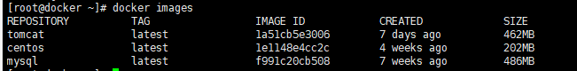
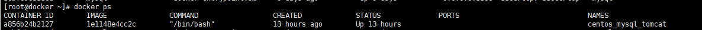
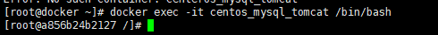
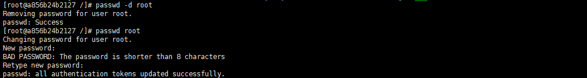
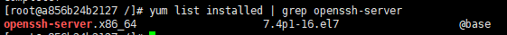
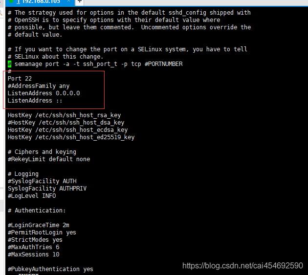
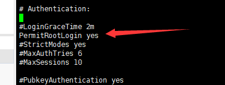
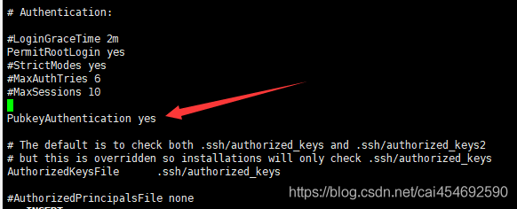
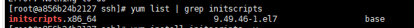
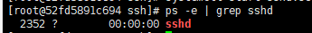

# 使用docker搭建Centos开发环境

## 一、使用Docker下载CentOS镜像

输入命令，下载centos的镜像

```shell
docker pull centos
```

下载完成后，使用命令`docker images`查看本地镜像列表



### 1.Docker启动CentOS镜像

输入以下命令，启动CenterOS容器

```
docker run --privileged -d  --name=centos_server centos /usr/sbin/init
```

**–privileged 和 /usr/sbin/init** **很重要！！！**
不然后面那你会发现启动[ssh](https://so.csdn.net/so/search?q=ssh&spm=1001.2101.3001.7020)服务的时候，会报错：
Failed to get D-Bus connection: Operation not permitted
**报错方案解决的资料：**
http://blog.sina.com.cn/s/blog_53e6076b0102wwp3.html
https://blog.csdn.net/xiaochonghao/article/details/64438246

更多docker启动容器命令详情参考： https://www.cnblogs.com/yfalcon/p/9044246.html

### 2.进入CentOS镜像容器，修改Root密码

输入以下命令查看正在运行的容器

```
docker ps
```


输入命令，进入容器里面

```
docker exec -it centos_server /bin/bash
```



输入命令 `passwd -d root` 清除root账号的密码,输入命令 `passwd root`进行修改root密码，然后重复两次输入新密码，如：123456



##### 2.1如果passwd不存在

###### 2.1.1.进入yum的repos目录

```shell
cd /etc/yum.repos.d/
```

###### 2.1.2.修改所有的CentOS文件内容

```shell
sed -i 's/mirrorlist/#mirrorlist/g' /etc/yum.repos.d/CentOS-*

sed -i 's|#baseurl=http://mirror.centos.org|baseurl=http://vault.centos.org|g' /etc/yum.repos.d/CentOS-*
```

###### 2.1.3.更新yum源为阿里镜像

```shell
wget -O /etc/yum.repos.d/CentOS-Base.repo https://mirrors.aliyun.com/repo/Centos-vault-8.5.2111.repo
yum clean all
yum makecache
```

###### 2.1.4.yum安装passwd

```shell
yum install passwd
```

### 3.修改ssh配置,允许root登录

#### 4.1安装ssh-server服务

###### 4.1.1.查看是否安装了ssh-server服务

```shell
yum list installed | grep openssh-server
```



如果如上图那样，表示已经安装好了

```shell
安装ssh-client命令:yum install openssh-clients
安装ssh-server命令:yum install openssh-server
```

#### 4.2 配置ssh-server服务

###### 1.找到了 /etc/ssh/ 目录下的sshd服务配置文件 sshd_config，

###### 2.用Vim编辑器打开`vi sshd_config`

> vim命令无效的，请参考这个链接的内容：https://blog.csdn.net/cai454692590/article/details/85871699

###### 3.将文件中，关于监听端口、监听地址前的 # 号去除



###### 4.开启允许远程登录



###### 5.开启使用用户名密码来作为连接验证



###### 6.按下Esc,输入命令 `：wq` 保存、退出。

### 5.开启ssh服务

###### 1.输入命令`ps -e | grep sshd`

> 检查是否开启了ssh服务 或 输入`netstat -an | grep 22` 检查 22 号端口是否开启监听

###### 2.开启ssh服务

>  输入命令 `service sshd start` 或 `systemctl start sshd.service`

如果出现service: command not found,则先安装service。

1. 输入命令 `yum list | grep initscripts` 查看版本

   
2. 输入命令 `yum install initscripts -y` 安装service
3. 输入命令 `service sshd start` 或 `systemctl start sshd.service` 开启ssh服务
4. 输入命令`ps -e | grep sshd` 检查是否开启了ssh服务

   

```shell
启动sshd服务命令 `systemctl start sshd.service`
重启 sshd服务命令 `systemctl restart sshd.service`
设置服务开启自启命令 `systemctl enable sshd.service`
```

### 7.打包原生centos

###### 1.先使用commit命令提交docker的容器镜像

```shell
docker commit 容器id 打包后镜像名称
docker commit xxx centos_server
```

###### 2.将新的镜像启动

```shell
# 镜像启动并将docker服务器的50001端口映射到容器的22端口上
docker run --privileged -d -p 50001:22 --name=centos_server 打包后镜像名称  /usr/sbin/init
```

######  3.打开主机防火墙

###### 4.远程ssh访问 
