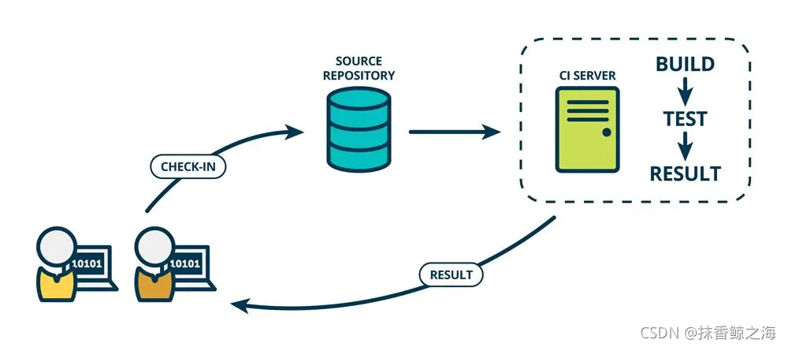
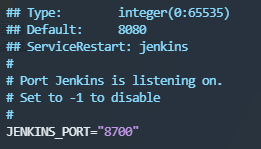
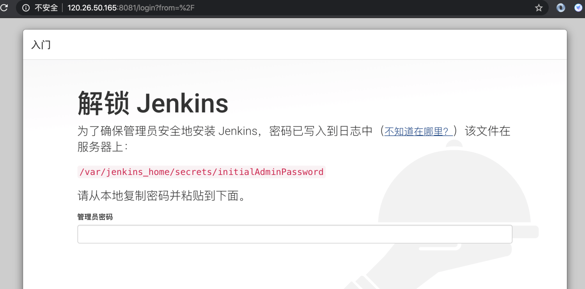
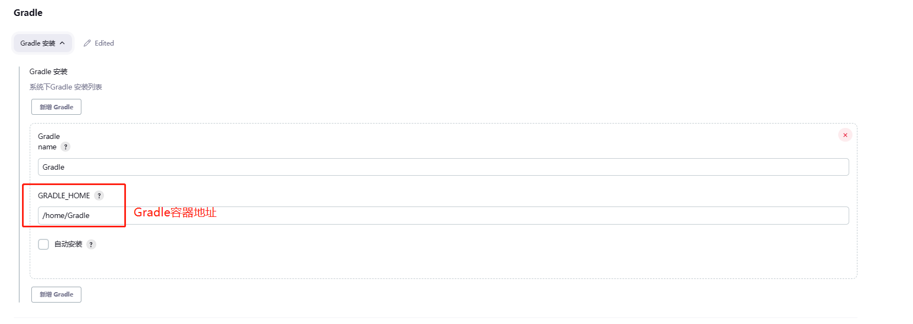
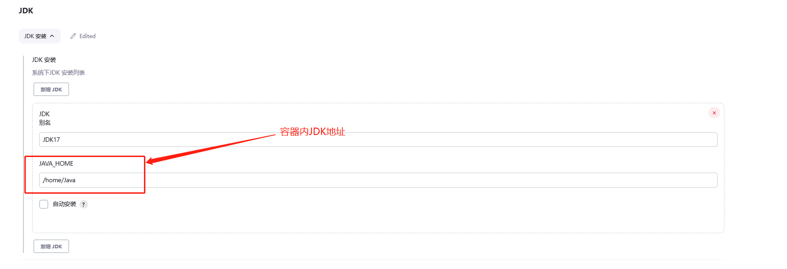
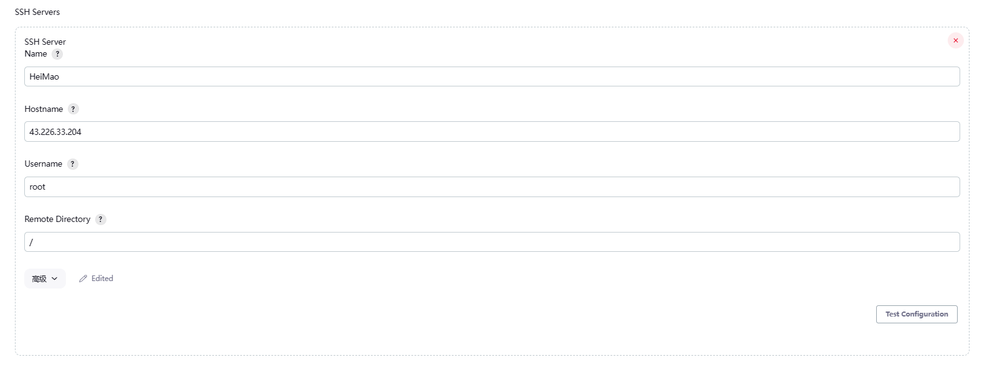

# 使用Jenkins部署

## 一、原理

### 1.什么是JenKins

Jenkins是一个开源的、提供友好操作界面的持续集成(CI)
工具，起源于Hudson（Hudson是商用的），主要用于持续、自动的构建/测试软件项目、监控外部任务的运行（这个比较抽象，暂且写上，不做解释）。Jenkins用Java语言编写，可在Tomcat等流行的servlet容器中运行，也可独立运行。通常与版本管理工具(
SCM)、构建工具结合使用。常用的版本控制工具有SVN、GIT，构建工具有Maven、Ant、Gradle。

### 2.CI/CD是什么？

CI(Continuous integration，中文意思是持续集成)
是一种软件开发时间。持续集成强调开发人员提交了新代码之后，立刻进行构建、（单元）测试。根据测试结果，我们可以确定新代码和原有代码能否正确地集成在一起。



CD(Continuous Delivery， 中文意思持续交付)是在持续集成的基础上，将集成后的代码部署到更贴近真实运行环境(类生产环境)
中。比如，我们完成单元测试后，可以把代码部署到连接数据库的Staging环境中更多的测试。如果代码没有问题，可以继续手动部署到生产环境。下图反应的是CI/CD
的大概工作模式。

## 二、安装Jenkins

### 方式一:部署教程

[CentOS 7 下Jenkins安装部署教程 - 腾讯云开发者社区-腾讯云 (tencent.com)](https://cloud.tencent.com/developer/article/1333792)

### 方式二:rmp安装

#### 1.下载rmp包

这是目前最新 [jenkins](https://so.csdn.net/so/search?q=jenkins&spm=1001.2101.3001.7020) LTS版本:
可以在去 [清华大学镜像站](https://mirrors.tuna.tsinghua.edu.cn/jenkins/redhat-stable/) 看一下，替换成最新的链接

```shell
wget https://mirrors.tuna.tsinghua.edu.cn/jenkins/redhat-stable/jenkins-2.361.4-1.1.noarch.rpm
```

#### 2.安装

```shell
sudo yum install jenkins-2.361.4-1.1.noarch.rpm
```

#### 2. 修改端口

> Jenkins 默认8080端口，如果和别的程序冲突，可以修改端口号

``` shell
vim /etc/sysconfig/jenkins
```



```shell
ps -ef | grep jenkins
```

#### 3. 开启服务

``` shell
systemctl start jenkins.service
```

#### 4.获取访问秘钥

``` shell
cat /var/lib/jenkins/secrets/initialAdminPassword
```

#### 5. 修改默认镜像源

``` shell
vim /var/lib/jenkins/hudson.model.UpdateCenter.xml
```

> 将 url 修改为 清华大学官方镜像：https://mirrors.tuna.tsinghua.edu.cn/jenkins/updates/update-center.json

``` xml
<?xml version='1.1' encoding='UTF-8'?>
<sites>
  <site>
    <id>default</id>
    <url>https://mirrors.tuna.tsinghua.edu.cn/jenkins/updates/update-center.json</url>
  </site>
</sites>
1234567
```

#### 5.访问

http://ip地址:端口号

### 方式三:Docker(推荐)

#### 1.Docker下载Jenkins

``` shell
docker pull jenkins/jenkins:lts //最新版
```

#### 2. 查看Jenkins镜像

``` shell
docker images
docker inspect jenkins镜像ID
```

#### 3.创建一个Jenkins目录

```shell
mkdir /home/Jenkins
```

#### 4.给Jenkins配置权限

```shell
chown -R 1000:1000 /home/Jenkins //用户组改变
```

#### 5.安装启动Jenkins容器

##### 5.1查询镜像

```shell
docker search jenkins/jenkins
```

##### （1）启动不带任何环境的容器

```shell
docker run -d -uroot -p 9095:8080 -p 50000:50000 --name jenkins -v /ssd1/home/Jenkins/jenkins_home:/var/jenkins_home -v /etc/localtime:/etc/localtime jenkins/jenkins
```

##### （2）启动非官方的容器(中文) 不推荐

```shell
docker run -d -uroot -p 9095:8080 -p 50000:50000 --name jenkins -v /ssd1/home/Jenkins/jenkins_home:/var/jenkins_home -v /etc/localtime:/etc/localtime jenkinszh/jenkins-zh
```

> [!tip]
> 备注：<br>
> -d //启动在后台 <br>
> -uroot 使用 root 身份进入容器，推荐加上，避免容器内执行某些命令时报权限错误 <br>
> -p 9095:8080 将容器内8080端口映射至宿主机9095端口，这个是访问jenkins的端口  <br>
> -p 50000:50000 将容器内50000端口映射至宿主机50000端口  <br>
> -v /home/jenkins_home:/var/jenkins_home:/var/jenkins_home目录为容器jenkins工作目录，我们将硬盘上的一个目录挂载到这个位置，方便后续更新镜像后继续使用原来的工作目录 <br>
> --name //容器名字 <br>
> -v /etc/localtime:/etc/localtime 让容器使用和服务器同样的时间设置  <br>
> -p //端口映射（8700：宿主主机端口，8080：容器内部端口） <br>
> -v //数据卷挂载映射（/home/Jenkins：宿主主机目录，另外一个即是容器目录） <br>
> Jenkins/jenkins:lts //Jenkins镜像（最新版） <br>

## 三、使用Jenkins

### 1.查看Jenkins启动情况

```shell
docker ps | grep jenkins
```

### 2.访问Jenkins

http://ip:port

### 3.解锁Jenkins

> [!tip]
> 在安装完成后，默认生成了一个登录密码，首次登录需要这个密码。
<br/>
> 密码路径：var/jenkins_home/secrets/initialAdminPassword //容器内部执行

#### 3.1进入JenkinsDocker容器内部

```shell
docker exec -it 容器名称 | 容器ID /bin/bash //进入jenkins容器

```

#### 3.2 查看Jenkins解锁密码

```shell
cat var/jenkins_home/secrets/initialAdminPassword 
```



### 4. 安装Jenkins插件

#### 4.1.安装中文插件

> Jenkins中文界面

[Localization: Chinese (Simplified)版本](https://plugins.jenkins.io/localization-zh-cn)

#### 4.2.安装Maven构建插件

> Jenkins 构建插件

[Maven Integration plugin](https://plugins.jenkins.io/maven-plugin)

#### 4.3.安装Git管理插件

> Jenkins Git

[Git plugin](https://plugins.jenkins.io/git)

#### 4.4.安装SSH

> 上传远程服务器插件

[Publish Over SSH版本](https://plugins.jenkins.io/publish-over-ssh)

#### 4.5.安装Pipeline

> 流水线插件

[Pipeline](https://plugins.jenkins.io/workflow-aggregator)

### 5.安装需要的环境

#### 5.1.安装Java

##### 5.1.1 创建JDK存放路径(物理机)

```shell
mkdir /usr/local/java
```

##### 5.1.2 官网下载JDK

[官网地址](https://www.oracle.com/cn/java/technologies/downloads/):https://www.oracle.com/cn/java/technologies/downloads/

##### 5.1.3 解压JDK到下载目录

```shell
cd /usr/local/java  #进入下载目录
wget JDK下载地址
tar -zxvf 下载的JDK文件
```

##### 5.1.4 将下载的JDK放入JenkinsDocker容器中

```shell
docker cp /usr/local/java 容器ID:容器地址
```

#### 5.2.安装Maven

方法同上

#### 5.3.安装Gradle

方法同上

### 6.配置全局工具



#### 6.1 JDK配置



#### 6.2 Maven配置

#### 6.3 Gradle配置


#### 6.4 OpenSSH配置



# 四、部署项目

## 1.部署静态网站项目

## 2.部署SpringBoot项目